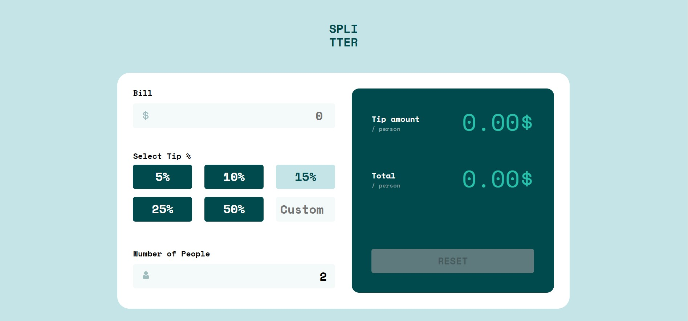

[View live site](https://kilelx.github.io/Tip-Calculator/){:target="_blank"}

# Frontend Mentor - Tip calculator app solution

This is a solution to the [Tip calculator app challenge on Frontend Mentor](https://www.frontendmentor.io/challenges/tip-calculator-app-ugJNGbJUX). Frontend Mentor challenges help you improve your coding skills by building realistic projects.

## Table of contents

- [Overview](#overview)
  - [The challenge](#the-challenge)
  - [Screenshot](#screenshot)
  - [Links](#links)
- [My process](#my-process)
  - [Built with](#built-with)
  - [What I learned](#what-i-learned)
- [Author](#author)

## Overview

### The challenge

Users should be able to:

- View the optimal layout for the app depending on their device's screen size
- See hover states for all interactive elements on the page
- Calculate the correct tip and total cost of the bill per person

### Screenshot

### Links

- Solution URL: [View live site](https://kilelx.github.io/Tip-Calculator/)

## My process

### Built with

- HTML5
- CSS3
- JavaScript

### What I learned

The JS part was a bit too difficult for me : I had no idea where to begun. I had to watch a tutorial on Youtube first, and the redo it by myself. I also still have some difficulties with the RegEx.

## Author

- Website - [Kieran LELEUX](http://www.kieran-leleux.com)
- Frontend Mentor - [@kilelx](https://www.frontendmentor.io/profile/kilelx)
